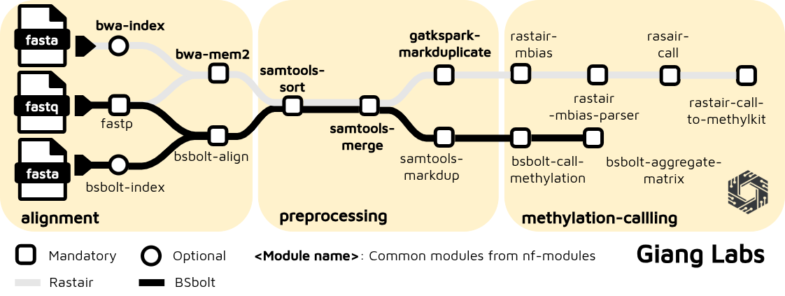

# Nextflow Short-Read Methylation

This repository implements a comprehensive Nextflow pipeline for bisulfite sequencing and methylation analysis. The pipeline supports two distinct methylation calling approaches:

1. **BSBolt** (default, `taps=false`) - BiSulfite Bolt: Fast bisulfite-aware alignment with methylation calling
2. **RASTAIR** (`taps=true`) - Modern TAPS-based C→T bisulfite conversion with BWA-MEM2 alignment

This pipeline provides integrated quality control, flexible alignment options, and comprehensive methylation calling with multiple output formats.

## Pipeline Architecture



## Primary Use Case

**Primary support**: **Illumina short-read bisulfite sequencing (RRBS, WGBS) and TAPS data with GRCh38 (hg38) alignment**

The pipeline is optimized for the following workflow:

- **Input**: Illumina short-read FASTQ files (required for all reports)
- **Quality Filtering**: FASTP for read-level trimming and quality filtering
- **Alignment**:
  - **BSBolt mode** (default): BSBolt bisulfite-aware alignment with C→T conversion
  - **RASTAIR/TAPS mode**: BWA-MEM2 alignment with C→T bisulfite conversion
- **Deduplication**: Removal of PCR duplicates (Samtools MarkDup for BSBolt, GATK MarkDuplicates for RASTAIR)
- **Methylation Calling**:
  - **BSBolt pathway**: Bisulfite-specific methylation calling with CGmap/BedGraph output
  - **RASTAIR pathway**: M-bias calculation, trimming, and RASTAIR methylation calling
- **Quality Metrics** (generated automatically):
  - M-bias analysis and plots
  - Methylation coverage reports
  - Cytosine context summary (CpG, CHG, CHH)
  - FASTP quality control reports
- **Aggregation** (BSBolt only): Cross-sample methylation matrix generation
- **Output**: BedGraph files, methylation calls, coverage reports, and aggregated matrices

### Configuration for Primary Use Case

```bash
# Default configuration uses:
# - BSBolt as methylation caller (or rastair with taps=true)
# - GRCh38/hg38 reference genome via --genome parameter
# - FASTP quality filtering
# - Automatic deduplication
# - Per-cytosine methylation reports

pixi run nextflow run main.nf \
  --input samplesheet.csv \
  --genome GRCh38 \
  -profile docker,bsbolt \
  -resume
```

## Quick Start

### 1. Prepare a Samplesheet

Create a CSV samplesheet with your FASTQ input. The pipeline requires FASTQ files as input to generate all quality control and methylation reports.

**Required Columns**:

- `sample`: Sample identifier
- `fastq_1`: Path to read 1 FASTQ file (gzipped, `.fastq.gz`)
- `fastq_2`: Path to read 2 FASTQ file for paired-end sequencing (optional)
- `lane`: Sequencing lane (optional, defaults to L001)

#### FASTQ Input (Required)

```csv
sample,lane,fastq_1,fastq_2
sample1,L001,/path/to/sample1_R1.fastq.gz,/path/to/sample1_R2.fastq.gz
sample2,L001,/path/to/sample2_R1.fastq.gz,/path/to/sample2_R2.fastq.gz
sample2,L002,/path/to/sample2_L002_R1.fastq.gz,/path/to/sample2_L002_R2.fastq.gz
sample3,L001,/path/to/sample3_R1.fastq.gz,
```

**Notes:**

- Single-end reads: Leave `fastq_2` empty
- Multiple lanes for same sample: Automatically merged after alignment
- All files must be gzip-compressed (`.fastq.gz`)
- **FASTQ input is required** to generate quality control reports, methylation calls, and M-bias analysis

### 2. Run the Pipeline

#### Standard Run (BSBolt - Default)

```bash
nextflow run main.nf \
  --input samplesheet.csv \
  --genome GRCh38 \
  -profile docker,bsbolt \
  -resume
```

#### RASTAIR/TAPS Pipeline

```bash
# Run with RASTAIR methylation calling (TAPS pathway)
nextflow run main.nf \
  --input samplesheet.csv \
  --genome GRCh38 \
  --taps true \
  --index_bwa2_reference true \
  -profile docker,rastair \
  -resume
```

#### Advanced Options

```bash
# All quality control and methylation reports are generated automatically
# No additional flags needed for reports - they are created by default

# BSBolt with automatic index building
nextflow run main.nf \
  --input samplesheet.csv \
  --genome GRCh38 \
  --index_bsbolt_reference true \
  -profile docker,bsbolt \
  -resume

# BSBolt with pre-built index
nextflow run main.nf \
  --input samplesheet.csv \
  --bsbolt_index /path/to/bsbolt_index \
  -profile docker,bsbolt \
  -resume

# Custom reference genome (alternative to --genome)
nextflow run main.nf \
  --input samplesheet.csv \
  --reference /path/to/reference.fa \
  -profile docker,bsbolt \
  -resume

# RASTAIR with custom trim parameters
nextflow run main.nf \
  --input samplesheet.csv \
  --genome GRCh38 \
  --taps true \
  --trim_OT 10 \
  --trim_OB 10 \
  -profile docker,rastair \
  -resume
```

For test mode with sample data:

```bash
nextflow run main.nf -profile docker,test,bsbolt -resume
```

### 3. View Results

Output files will be generated in the `results/` directory.

#### BSBolt Pipeline Results:

```
results/
├── fastp/                           # Quality control reports
│   ├── *.html
│   └── *.json
├── bsbolt/
│   ├── alignment/                   # Aligned BAM files
│   ├── methylation_calls/
│   │   ├── *.cgmap.gz               # CGmap format methylation calls
│   │   ├── *.bedGraph.gz            # BedGraph format for visualization
│   │   └── *.txt                    # Text format calls
│   └── aggregate_matrix/            # Cross-sample methylation matrix
│       └── *_matrix.txt
├── samtools/
│   └── deduplicated/                # Deduplicated BAM files
│       ├── *.dup.bam
│       └── *.dup.bam.bai
├── merged_alignment/                # Sorted and merged alignments
│   ├── *.bam
│   ├── *.bam.bai
│   ├── *.cram
│   └── *.cram.crai
└── pipeline_info/                   # Execution logs
```

#### RASTAIR/TAPS Pipeline Results:

```
results/
├── fastp/                           # Quality control reports
├── gatk/
│   └── deduplicated/                # Deduplicated BAM files
├── rastair/
│   ├── mbias/                       # M-bias calculation results
│   ├── mbiasparser/                 # M-bias plots and trim parameters
│   ├── call/                        # Methylation calls
│   └── methylkit/                   # MethylKit format files
└── pipeline_info/                   # Execution logs
```

#### Key Output Files:

**Methylation Calls (BSBolt):**

- `*.cgmap.gz` - CGmap format (platform-independent methylation format)
- `*.bedGraph.gz` - BedGraph format (compatible with IGV, UCSC, etc.)
- `*.txt` - Text format methylation calls
- `*_matrix.txt` - Aggregated cross-sample methylation matrix

**Methylation Calls (RASTAIR):**

- `*.txt` - Methylation site calls
- `*.methylkit.txt.gz` - MethylKit format for R analysis

**Quality Metrics:**

- `*.mbias.txt` - M-bias analysis by read position
- `*_fastqc.html` - Read quality reports

## Pipeline Modes

### BSBolt Mode (Default)

Bisulfite-aware alignment and methylation calling with BSBolt:

```bash
nextflow run main.nf \
  --input samplesheet.csv \
  --genome GRCh38 \
  -profile docker,bsbolt
```

**Workflow:**

1. FASTP quality filtering and trimming
2. BSBolt genome preparation (index building)
3. BSBolt bisulfite-aware alignment
4. Samtools duplicate marking and indexing
5. BSBolt methylation calling (CGmap format)
6. Cross-sample methylation matrix aggregation

**Output:** CGmap, BedGraph, aggregated matrices

**Key Features:**
- Fast, accurate bisulfite-aware alignment
- Bisulfite-specific error handling
- CGmap format output
- Cross-sample matrix aggregation for comparative analysis

### RASTAIR/TAPS Mode

Modern TAPS-based methylation analysis with C→T conversion:

```bash
nextflow run main.nf \
  --input samplesheet.csv \
  --genome GRCh38 \
  --taps true \
  --index_bwa2_reference true \
  -profile docker,rastair
```

**Workflow:**

1. FASTP quality filtering and trimming
2. BWA-MEM2 genome indexing and alignment
3. Deduplication (GATK MarkDuplicates)
4. M-bias calculation and optimization
5. RASTAIR methylation calling with trim parameters
6. MethylKit format conversion

**Output:** M-bias plots, methylation calls, MethylKit files

**Key Features:**
- TAPS-specific workflow with optimized parameters
- M-bias analysis and trimming
- MethylKit format for R integration

## Production Usage

For production runs, always specify the `--genome` parameter to ensure consistent reference genome usage:

```bash
# Production BSBolt run
nextflow run main.nf \
  --input samplesheet.csv \
  --genome GRCh38 \
  -profile docker,bsbolt \
  -resume

# Production RASTAIR run
nextflow run main.nf \
  --input samplesheet.csv \
  --genome GRCh38 \
  --taps true \
  --index_bwa2_reference true \
  -profile docker,rastair \
  -resume
```

### Supported Genomes

The pipeline supports the following reference genomes via the `--genome` parameter:

| Genome   | Description                                 | Provider       |
| -------- | ------------------------------------------- | -------------- |
| `GRCh38` | Human reference genome build 38 (hg38)      | GATK/iGenomes  |
| `test`   | Chr22 GRCh38 genome for pipeline validation | local (assets) |

### Alternative: Custom Reference Genomes

If using a genome not in the standard list, provide explicit reference paths instead:

```bash
nextflow run main.nf \
  --input samplesheet.csv \
  --reference /path/to/reference.fa \
  -profile docker,bsbolt \
  -resume
```

## Key Features

- **FASTQ Input Required**: All quality control and methylation reports are generated automatically without additional flags
- **Two Methylation Pathways**:
  - **BSBolt**: Bisulfite-aware alignment with CGmap and BedGraph output, plus cross-sample matrix aggregation
  - **RASTAIR/TAPS**: Modern C→T bisulfite conversion with BWA-MEM2 alignment and MethylKit formatting
- **Flexible Alignment Options**: BSBolt or BWA-MEM2 with automatic index building
- **Quality Control**: FASTP trimming with comprehensive QC reports (generated automatically)
- **M-bias Analysis**: Automatic M-bias calculation and visualization plots (RASTAIR mode)
- **Methylation Calling**: Per-cytosine calls with context-specific reporting (CpG, CHG, CHH) - no configuration needed
- **Deduplication**: Automatic PCR duplicate removal (Samtools for BSBolt, GATK MarkDuplicates for RASTAIR)
- **Multi-lane Support**: Automatic merging of multiple sequencing lanes per sample
- **Output Formats**: CGmap, BedGraph, MethylKit format, aggregated matrices
- **Flexible Configuration**: Container support (Docker/Singularity), multiple profiles
- **Comprehensive Testing**: Full test suite with nf-test snapshots

## Configuration Parameters

### Essential Parameters

| Parameter         | Default   | Description                    |
| ----------------- | --------- | ------------------------------ |
| `input`           | null      | Path to samplesheet CSV        |
| `outdir`          | "results" | Output directory               |
| `genome`          | "GRCh38"  | Reference genome (test/GRCh38) |
| `reference`       | null      | Custom reference FASTA path    |
| `reference_index` | null      | Reference FAI index            |

### Pipeline Selection

| Parameter              | Default | Description                           |
| ---------------------- | ------- | ------------------------------------- |
| `taps`                 | false   | Use RASTAIR (true) or BSBolt (false)  |
| `bsbolt_index`         | null    | Pre-built BSBolt index directory      |
| `index_bsbolt_reference` | false  | Build BSBolt index from reference     |
| `bwa2_index`           | null    | Pre-built BWA-MEM2 index directory    |
| `index_bwa2_reference` | false   | Build BWA-MEM2 index from reference   |

### RASTAIR-Specific Options

| Parameter | Default | Description                                |
| --------- | ------- | ------------------------------------------ |
| `trim_OT` | null    | Original top-strand nucleotides to trim    |
| `trim_OB` | null    | Original bottom-strand nucleotides to trim |

### Workflow Options

| Parameter          | Default   | Description                               |
| ------------------ | --------- | ----------------------------------------- |
| `publish_dir_mode` | "symlink" | Output directory mode (symlink/copy/move) |

## BSBolt-Specific Parameters

### Index Parameters (BSBOLT_INDEX)

| Parameter | Default | Description |
| --------- | ------- | ----------- |
| `index_bsbolt_reference` | false | Build BSBolt index from reference genome on first run |
| `bsbolt_index` | null | Path to pre-built BSBolt index directory (optional) |

**Usage:**
```bash
# Auto-build index from reference
nextflow run main.nf --genome GRCh38 --index_bsbolt_reference true -profile docker,bsbolt

# Use pre-built index
nextflow run main.nf --bsbolt_index /path/to/index -profile docker,bsbolt
```

### Alignment Parameters (BSBOLT_ALIGN)

#### Input/Output Options

| Parameter | Default | Type | Description |
| --------- | ------- | ---- | ----------- |
| `bsbolt_align_os` | false | boolean | Output single-strand BAM (default: output both strands) |
| `bsbolt_align_ot` | 1 | integer | Original top strand [0=C/T conversion, 1=bisulfite C/T] |
| `bsbolt_align_smart_pairing` | false | boolean | Enable smart pairing detection |
| `bsbolt_align_read_group` | null | string | SAM read group header line (e.g., "@RG\tID:sample1\tSM:sample1") |
| `bsbolt_align_xa` | null | integer | Max secondary alignments to output [0-255] |
| `bsbolt_align_dr` | null | string | Duplicate read handling [0=keep all, 1=mark duplicates, 2=remove] |

#### Scoring Options

| Parameter | Default | Type | Description |
| --------- | ------- | ---- | ----------- |
| `bsbolt_align_score_match` | 1 | integer | Match score (+A flag) |
| `bsbolt_align_score_mismatch` | 4 | integer | Mismatch penalty (-B flag) |
| `bsbolt_align_indel_penalty` | 6 | integer | Indel open penalty (-INDEL flag) |
| `bsbolt_align_gap_ext` | 1 | integer | Gap extension penalty (-E flag) |
| `bsbolt_align_clip_penalty` | 5 | integer | Soft clipping penalty (-L flag) |
| `bsbolt_align_unpaired_penalty` | 9 | integer | Unpaired read penalty (-U flag) |

#### Bisulfite-Specific Options

| Parameter | Default | Type | Description |
| --------- | ------- | ---- | ----------- |
| `bsbolt_align_undirectional` | false | boolean | Bisulfite library is undirectional |
| `bsbolt_align_ch_conversion` | null | float | Non-CpG methylation conversion rate (0.0-1.0) |
| `bsbolt_align_ch_sites` | null | string | Non-CpG sites to consider (CHG/CHH) |
| `bsbolt_align_substitution_threshold` | null | float | Threshold for substitution calling |

#### Algorithm Options

| Parameter | Default | Type | Description |
| --------- | ------- | ---- | ----------- |
| `bsbolt_align_seed_length` | 19 | integer | Seed length (-k flag) |
| `bsbolt_align_band_width` | 100 | integer | Band width for alignment (-w flag) |
| `bsbolt_align_diagonal_drop` | 0 | integer | Diagonal drop threshold (-d flag) |
| `bsbolt_align_internal_seed` | null | integer | Internal seed length (-r flag) |
| `bsbolt_align_seed_occ` | null | integer | Seed occurrence threshold (-y flag) |
| `bsbolt_align_max_seed_occ` | 500 | integer | Max seed occurrences (-c flag) |
| `bsbolt_align_chain_drop` | 20 | integer | Chain drop threshold (-D flag) |
| `bsbolt_align_chain_min` | 0 | integer | Min chain length (-W flag) |
| `bsbolt_align_mate_rescue` | null | integer | Mate rescue threshold (-m flag) |
| `bsbolt_align_skip_mate_rescue` | false | boolean | Skip mate rescue (-S flag) |
| `bsbolt_align_skip_pairing` | false | boolean | Skip pairing info (-P flag) |
| `bsbolt_align_ignore_alt` | false | boolean | Ignore ALT contigs (-j flag) |
| `bsbolt_align_min_score` | null | integer | Minimum alignment score (-T flag) |
| `bsbolt_align_mark_secondary` | false | boolean | Mark secondary alignments (-M flag) |
| `bsbolt_align_insert_size` | null | integer | Expected insert size (-I flag) |

### Methylation Calling Parameters (BSBOLT_CALL_METHYLATION)

| Parameter | Default | Type | Description |
| --------- | ------- | ---- | ----------- |
| `bsbolt_call_text` | false | boolean | Output text format methylation calls |
| `bsbolt_call_bedgraph` | false | boolean | Output BedGraph format |
| `bsbolt_call_cpg_only` | false | boolean | Only output CpG sites (-CG flag) |
| `bsbolt_call_remove_ccgg` | false | boolean | Remove CCGG sites (-remove-ccgg flag) |
| `bsbolt_call_verbose` | false | boolean | Verbose output |
| `bsbolt_call_ignore_overlap` | true | boolean | Ignore overlapping pairs |
| `bsbolt_call_max_depth` | null | integer | Maximum read depth per site |
| `bsbolt_call_min_depth` | 1 | integer | Minimum read depth per site |
| `bsbolt_call_base_quality` | 0 | integer | Minimum base quality (-BQ flag) |
| `bsbolt_call_mapping_quality` | 0 | integer | Minimum mapping quality (-MQ flag) |
| `bsbolt_call_ignore_orphans` | false | boolean | Ignore orphaned reads (-IO flag) |

### Aggregation Parameters (BSBOLT_AGGREGATE_MATRIX)

| Parameter | Default | Type | Description |
| --------- | ------- | ---- | ----------- |
| `bsbolt_aggregate_min_coverage` | 10 | integer | Minimum coverage threshold per site |
| `bsbolt_aggregate_min_sample` | 0.8 | float | Min proportion of samples with valid coverage (0.0-1.0) |
| `bsbolt_aggregate_cgonly` | false | boolean | Only include CpG sites |
| `bsbolt_aggregate_count_matrix` | false | boolean | Output count matrix with methylated/total counts |
| `bsbolt_aggregate_verbose` | false | boolean | Verbose output |
| `bsbolt_aggregate_sample_labels` | null | string | Comma-separated sample labels or path to label file |

**Usage:**
```bash
# Default aggregation (10x coverage, 80% sample requirement)
nextflow run main.nf --input samplesheet.csv -profile docker,bsbolt

# Stringent aggregation (30x coverage, 100% samples)
nextflow run main.nf --input samplesheet.csv \
  --bsbolt_aggregate_min_coverage 30 \
  --bsbolt_aggregate_min_sample 1.0 \
  -profile docker,bsbolt

# CpG-only count matrix
nextflow run main.nf --input samplesheet.csv \
  --bsbolt_aggregate_cgonly true \
  --bsbolt_aggregate_count_matrix true \
  -profile docker,bsbolt
```

## Preset Configurations for Different Data Types

### WGBS (Whole Genome Bisulfite Sequencing)

WGBS provides comprehensive methylation coverage across the entire genome with relatively high and uniform coverage.

```bash
nextflow run main.nf \
  --input samplesheet.csv \
  --genome GRCh38 \
  --index_bsbolt_reference true \
  --bsbolt_align_seed_length 19 \
  --bsbolt_align_min_score 60 \
  --bsbolt_call_min_depth 5 \
  --bsbolt_call_base_quality 20 \
  --bsbolt_call_mapping_quality 30 \
  --bsbolt_aggregate_min_coverage 10 \
  --bsbolt_aggregate_min_sample 0.8 \
  -profile docker,bsbolt \
  -resume
```

**Key settings:**
- Medium seed length (19bp) for sensitive alignment
- Moderate minimum score (60) for accuracy
- Low minimum depth (5) for coverage flexibility
- Base quality threshold (20) to filter poor quality bases
- Mapping quality (30) to ensure reliable alignments
- Matrix aggregation at 10x coverage with 80% sample requirement

### Masked WGBS (WGBS with Repeat Masking)

Masked WGBS uses repeat-masked reference genome to improve alignment specificity in repetitive regions.

```bash
nextflow run main.nf \
  --input samplesheet.csv \
  --reference /path/to/genome.fa.masked \
  --index_bsbolt_reference true \
  --bsbolt_align_seed_length 20 \
  --bsbolt_align_band_width 200 \
  --bsbolt_align_min_score 70 \
  --bsbolt_call_min_depth 5 \
  --bsbolt_call_base_quality 25 \
  --bsbolt_call_mapping_quality 40 \
  --bsbolt_aggregate_min_coverage 15 \
  --bsbolt_aggregate_min_sample 0.9 \
  -profile docker,bsbolt \
  -resume
```

**Key settings:**
- Slightly longer seed (20bp) for better specificity with masked regions
- Wider band (200) for flexible gapped alignment
- Higher minimum score (70) for masked genome reliability
- Higher quality thresholds for stringency
- Stricter aggregation (15x, 90% samples) for high-confidence sites
- Useful for repeat-rich regions and complex genomes

### RRBS (Reduced Representation Bisulfite Sequencing)

RRBS targets CpG-rich regions via enzymatic digestion (MspI/HpaII), resulting in fragment-biased coverage patterns and fewer sites than WGBS.

```bash
nextflow run main.nf \
  --input samplesheet.csv \
  --genome GRCh38 \
  --index_bsbolt_reference true \
  --bsbolt_align_seed_length 16 \
  --bsbolt_align_max_seed_occ 2000 \
  --bsbolt_align_skip_pairing true \
  --bsbolt_call_min_depth 3 \
  --bsbolt_call_base_quality 15 \
  --bsbolt_call_mapping_quality 20 \
  --bsbolt_call_cpg_only true \
  --bsbolt_aggregate_min_coverage 5 \
  --bsbolt_aggregate_min_sample 0.7 \
  --bsbolt_aggregate_cgonly true \
  -profile docker,bsbolt \
  -resume
```

**Key settings:**
- Shorter seed (16bp) for highly repetitive CpG regions
- Higher max seed occurrences (2000) to handle over-representation
- Skip pairing info for RRBS which may have unusual insert sizes
- Lower minimum depth (3) due to targeted nature
- Lower quality thresholds (15 BQ, 20 MQ) - RRBS has different quality profiles
- CpG-only output for focused analysis
- Relaxed aggregation (5x, 70% samples) since RRBS has fewer total sites

**RRBS Considerations:**
- Library preparation includes MspI/HpaII digestion
- Fragments typically 40-220bp range
- Highly enriched for CpG sites
- May have biased fragment size distribution
- Often shows quality patterns different from WGBS


The pipeline includes comprehensive tests for both BSBolt and RASTAIR pathways:

```bash
# Run BSBolt pipeline test
make test-bsbolt

# Run RASTAIR pipeline test
make test-rastair

# Run all tests
make test-e2e

# Update test snapshots after changes
make test-bsbolt-update-snapshot
make test-rastair-update-snapshot

# Lint Nextflow code
make lint

# Clean work directories and results
make clean
```

## Pipeline Requirements

### Nextflow

- **Version**: >=25.10.2
- **DSL**: DSL2 enabled

### Container System

- **Docker**: For containerized execution
- **Singularity**: Alternative container runtime

### Reference Genomes

The pipeline includes pre-configured references:

**GRCh38 (Human):**

- FASTA: `s3://ngi-igenomes/igenomes/Homo_sapiens/GATK/GRCh38/Sequence/WholeGenomeFasta/Homo_sapiens_assembly38.fasta`
- FAI: `s3://ngi-igenomes/igenomes/Homo_sapiens/GATK/GRCh38/Sequence/WholeGenomeFasta/Homo_sapiens_assembly38.fasta.fai`

**Test Genome:**

- Available via `-profile test` flag

### Tool Versions (via Containers)

| Tool     | Version | Purpose                                      |
| -------- | ------- | -------------------------------------------- |
| fastp    | 1.1.0   | Read QC and trimming                         |
| BSBolt   | 1.6.0   | Bisulfite-aware alignment & methylation      |
| BWA-MEM2 | Latest  | High-speed sequence alignment                |
| Samtools | 1.18    | BAM/SAM manipulation                         |
| Picard   | 3.1.1   | SAM/BAM utilities                            |
| RASTAIR  | 0.8.2   | TAPS-based methylation calling               |

## Pipeline Components

### Modules

The pipeline uses modular components for:

- **Quality Control**: FASTP read trimming and filtering
- **Reference Preparation**: Indexing (BSBolt, BWA-MEM2, FASTA)
- **Alignment**: BSBolt or BWA-MEM2
- **Deduplication**: Samtools MarkDup (BSBolt) or GATK MarkDuplicates (RASTAIR)
- **Methylation Calling**: BSBolt calling or RASTAIR calling
- **Aggregation**: Cross-sample matrix generation (BSBolt only)
- **Output Processing**: Coverage conversion, MethylKit formatting

### Subworkflows

The pipeline organizes complex workflows into subworkflows:

- **BSBOLT_ALIGNMENT**: Index building → alignment → sorting/merging
- **BWAMEM2_ALIGNMENT**: Optional index → alignment → sorting/merging
- **BSBOLT_METHYLATION_CALLING**: CGmap generation → aggregation
- **RASTAIR_METHYLATION_CALLING**: M-bias → trimming → calling → formatting

## Output Description

### BSBolt Mode

**Alignment Results:**

- `bsbolt/alignment/*.bam` - Aligned BAM files
- `samtools/deduplicated/*.dup.bam` - Deduplicated BAM files
- `merged_alignment/*.bam` - Sorted and merged alignments

**Methylation Results:**

- `bsbolt/methylation_calls/*.cgmap.gz` - CGmap format methylation calls
- `bsbolt/methylation_calls/*.bedGraph.gz` - BedGraph format for visualization
- `bsbolt/methylation_calls/*.txt` - Text format methylation calls
- `bsbolt/aggregate_matrix/*_matrix.txt` - Cross-sample aggregated matrix

**Quality Reports:**

- `fastp/*.html` - Read quality reports

### RASTAIR/TAPS Mode

**Methylation Results:**

- `rastair/mbias/*.txt` - M-bias calculation results
- `rastair/mbiasparser/*.pdf` - M-bias visualization plots
- `rastair/call/*.txt` - Methylation site calls
- `rastair/methylkit/*.txt.gz` - MethylKit format for R

**Quality Reports:**

- `gatk/deduplicated/*.bam` - Deduplicated BAM files
- `fastp/*.html` - Read quality reports

## Support and Documentation

For additional information and advanced usage:

- See example samplesheet: `assets/samplesheet_fastq.csv`
- View pipeline diagram: `docs/gianglabs-pipeline-nf-short-read-methylation.drawio.png`
- Test data available in: `assets/input/`

## License

MIT ([LICENSE](LICENSE))
